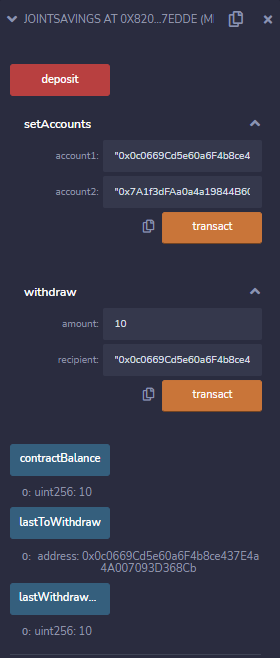

# Joint_Saving_Accounts_Solidity

Giving a user the ability to safetly set two accounts with withdraw cryptocurrrency and visually verfiy the transaction process. 

* For testing: Use the provided "Dummy Addresses"

###account1 address: 0x0c0669Cd5e60a6F4b8ce437E4a4A007093D368Cb
###account2 address: 0x7A1f3dFAa0a4a19844B606CD6e91d693083B12c0

# Usage

Use the joint_savings.sol file within https://remix.ethereum.org/ 

* Create new file in the "file explorers" tab and copy the contents of the joint_savings.sol file

* Compile the file with "0.5.0 commit"

* Deploy the contractin the "Deploy & Run Transactions" tab

* Deposit an amount of currency into the user wallet in order to simulate the transaction in the next step

##Transaction 1: Send 1 ether as wei.

##Transaction 2: Send 10 ether as wei.

##Transaction 3: Send 5 ether.

